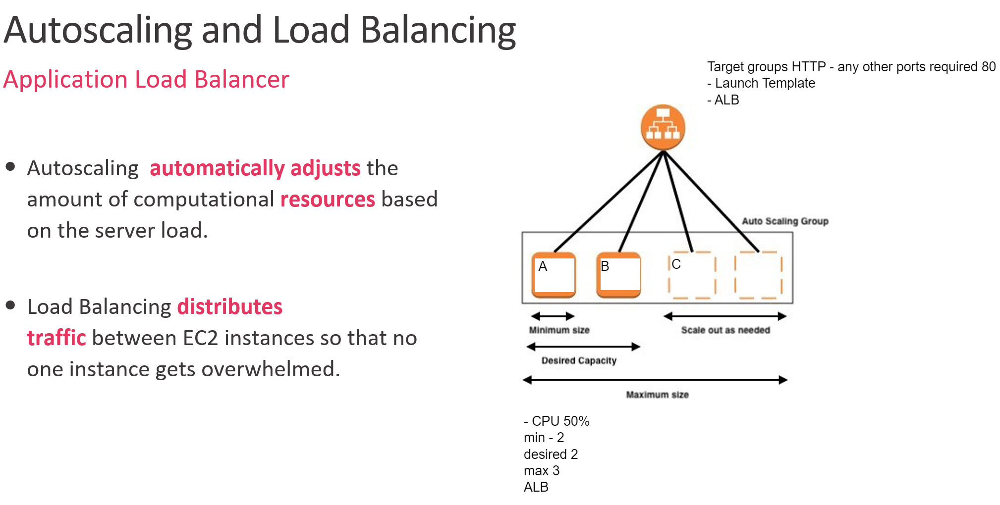

# auto sclaing and load balancing 


## What is load balancing 
- Load balancing is the method of distributing network traffic equally across a pool of resources that support an application.

## What is auto scaling 
- Autoscaling is a cloud computing feature that enables organizations to scale cloud services such as server capacities or virtual machines up or down automatically, based on defined situations such as traffic ir utilization levels.

## What is alb (aplication load balancer)
- Application Load Balancer is a feature of Elastic Load Balancing that allows a developer to configure and route incoming end-user traffic to applications based in the AWS public cloud.

## What is a target group 
A target group tells a load balancer where to direct traffic to : EC2 instances, fixed IP addresses; or AWS Lambda functions, amongst others. 

# Launching a template for autoscaling group 

- On the left hand side of aws you should find a tab saying launch template 
- select launch template 
- we then need to select `Create launch template` as we dont have one created 
- use normal naming convention for this 
- tick the box for `auto scaling guidance`  
- select unbuntu 18.04 as we normaly do
- sleect t2 micro as an instacne type as normal 
- for user data we need to use the provisioning used to install and get nginx working 
- you will need to click on advanced details and scroll to the bottom where it says user data 
- then input this code 
``` 
#!/bin/bash

sudo apt update -y
sudo apt upgrade -y

sudo apt install nginx -y
sudo systemctl restart nginx
sudo systemctl enable nginx
```
If there are any typos or errors then nginx wont run

## Now we have launch template we now need to creat a ASG, policy 

- you will need to create and auto scaling group 
- same naming convention as before 
- select the launch template we made ealier 
- go next
- default vpc
- need to create insances on eu-west-1a, 1b, and 1c
- go next
- select attach new load balancer 
- select application load balancer 
- name will be auto generated 
- select internet facing 
- slect port 80 create a target group 
- tick the box for elb!!!!! 
- go next
- group size: Desired - 2, Minimum - 2, Maximum - 3
- target tracking policy 
- make sure cpu utilisation is selected 
- go next
- dont need notifications so go next
- for tags in key type Name and then normal naming convention for value 
- lastly select auto scaling group 
- if it works you should just have to put in your ip adress and see this 


## How to get the app working with a load balancer 

- the majority of the steps wqill be the same as before however this time in user data you will need to add this code to it for the app to start working 

```
#!/bin/bash

sudo apt-get update -y
sudo apt-get upgrade -y
sudo apt-get install nginx -y
sudo systemctl start nginx 
sudo systemctl enable nginx -y


sudo systemctl restart nginx -y

sudo apt-get install python -y

sudo apt-get install python-software-properties
curl -sL https://deb.nodesource.com/setup_12.x | sudo -E bash -
sudo apt-get install nodejs -y


sudo npm install pm2 -g

git clone ("your git here")

cd tech201_vertualisation 
cd app
cd app
npm install 
node app.js`
```
- you should se this with copying the ip adress with portt 3000 


best practice use this command `nohup npm start 2>/dev/null 1>/dev/null&`
then next best is `sudo npm install forever -g` `forever start app.js`
then last use the command that is shown above. 