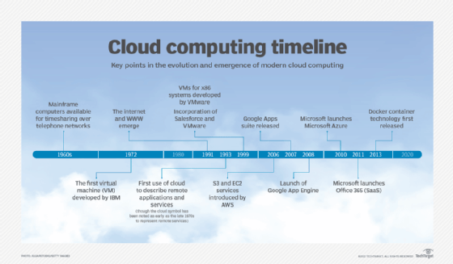
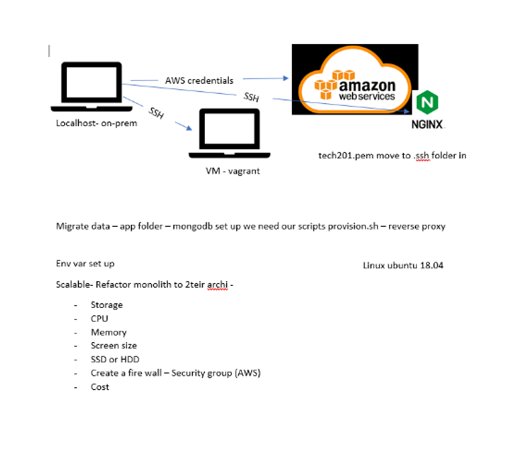
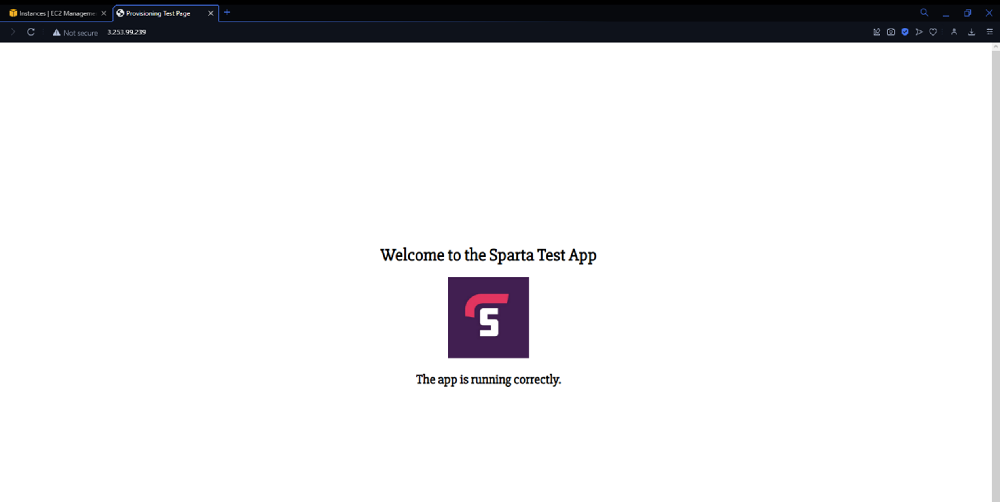

# Cloud computing with AWS

- When logging on to AWS make sure to never share your passwrod!! 
- Also make sure to always select Ireland as the location.  

### What is cloud computing??
- cloud computing is the delivery of computing services this inlcudes servers, storage, databases, networking, software, analytics, and intelligence over the cloud. This offers faster inovation and flexible resources.
### History of Cloud

### Different ypes of cloud 
- Public cloud, This ism offerd by third party providers, it is avalibale to anyone over the public internet also it scales quickly and is very convenient 
- private cloud, This is offerd to select users over the internet or private internal networks, it provides greater security control and requires traditional datacenter staffing and maintenance.
- Hybrid cloud, This is a combination of both the public and private cloud, shared security responsability and helps maintain tighter controls over sensative data processes. 

### what is AWS?
- Amazon Web Services (AWS) is a comprehensive cloud computing platform that includes infrastructure as a service (IaaS) and platform as a service (PaaS) offerings. AWS services offer scalable solutions for compute, storage, databases, analytics, and more.
- Infrastructure as a Service (IaaS): Provides virtualized computing resources, such as servers, storage, and networking, that can be rented and accessed over the internet. With IaaS, users are responsible for managing and securing their own applications and data.
- Platform as a Service (PaaS): Provides a platform for building and deploying software applications without the need to manage the underlying infrastructure. PaaS typically includes application development tools, databases, and middleware.
- Software as a Service (SaaS): Provides access to software applications over the internet, with the infrastructure and maintenance handled by the service provider. SaaS applications are typically accessed through a web browser.

### Histroy of AWS

- capital expenditure: you will need to buy servers,cables and networking equipment 
- Operational expenditure allows company to only pay for what they use, this provides companies with much higher levels of flexibility 

# launching an pp with aws steps

## step 1

- Make sure the name and tags is written as (your name- group name - app)

## Step 2

- make sure ubuntu 18.04 has been selected 

## Step 3

- Make sure instance type is t2.micro

## step 4

- make sure you select the correct key pair 

## step 5

- edit network settings
- make sure default vpc is selected 
- select subnet DevOpsStudent default 1a
- enable auto-assign public ip
- create security group 
- security group name same as the instance 
- add securtiy group make sure that ssh is with my ip, http is anywhere and add one more security group as anywhere and add port range 3000
- once all this is completed launch trhe machiine 

## step 6

- once you have launched connect to your instance and find ssh client 
- got to gitbash and follow the next steps
- run this command to get the correct permision `chmod 400 <key pair>` run `ls -ll` to see it has worked
- then run the ssh with this code `ec2(ip).eu-west-1.computate.amazonaws.com`
- once inside the ssh then `sudo apt-get update -y`
- after this then `sudo apt-install nginx` to install nginx copy your ip adress and you should see nginx on your browser

## How to get app working with aws ec2

- once you have nginx running exit out of the ssh file and into the .ssh folder and input this code `scp -i <key pair> -r <your app path> ubuntu@<your IP in the example block you paste to ssh into ec2>:/home/ubuntu` it will take abiut of time to load everything in 
- once it has all loaded up you should just have to run node app.js and then input your ip adress wiht :3000 at the end to get the app up and running ]
- if your reverse proxy isnt set up atuomtically you will have to input it manually 
- use `sudo nano /etc/nginx/sites-available/default to be able to
location / { proxy_pass http://localhost:8080; proxy_http_version 1.1; proxy_set_header Upgrade $http_upgrade; proxy_set_header Connection 'upgrade'; proxy_set_header Host $host; proxy_cache_bypass $http_upgrade; } }` add this to and chnage where it says 8000 to what ever port your computer is listening on
- then run sudo nginx -t
- finally use sudo systemctl restart nginx
- then you should just be able to run the ip adress without adding the port number on the end
and you should just have this 

## ssh 

key pairs connect

## two tier architecture 

- ireland is used as we are all based in the uk and it has 3 AZs
- When we launch auto scaler group and load balancer we will want to launch in multiple AZ's so we can balance the traffic and make it highly available
- vpc is a virutal private cloud oprovides a range of postcodes 
- need to refactor becasue monolith architectre is not scalabel 
- Refactoring also allows for agile methodology and scrum framework
- scalable means that if you want another feature, can connect to another subnet via a gateway, want another feature, can connect to another subnet via a gateway, 

- develop that subnet independetly without affecting the user journey, since all other features fucntion indepenmdently.

## Two tier- deploying our database vm on ec2

### requirements 

- app teir deployed on public ip on pot 3000
- To create 2nd tier dependencies: ubuntu 18.04LTS – mongodb installed – changed configuration mongod.conf 0.0.0.0- Security group for our DB – allow 27017 from anywhere – allow only form app instance – create an environment variable in app instance with DB endpoint relaunch the app

## getting mngodb working with the cloud 

- launch a new isntance making sure that they key paur is still correct and you have added a new secrutiy gorup with the ip adress of mongodb 
- open gitbash and ssh into the database file make sure to git clone you git hub to access the files need however githubn may not always be working so use the scp method instead. after you are in github file navigate to the databse folder.
- run the command ls to make sure that you have the provision.sh file in the folder 
- then run `sudo chamod +x provision.sh` to make sure that you have the correct permisions.
- after this `sudo nano provision.sh` to make sure yopu have the correct script in the file
- then run `sudo ./provision.sh` to run the file 
- after this run sudo apt-get update -y` and sudo apt-get upgrade -y` to update and upgarde the file to make it work.
- to check mongodb is working run `sudo systmectl status mongod` it shoudl come up as green and say runnign 

## blockers and how to fix them 

when running mongodb make sure you comment out the two lines that delete the file and add in the new file. 