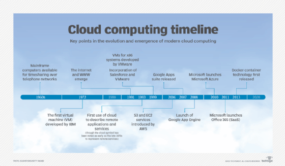
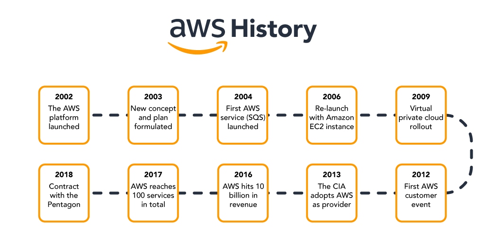
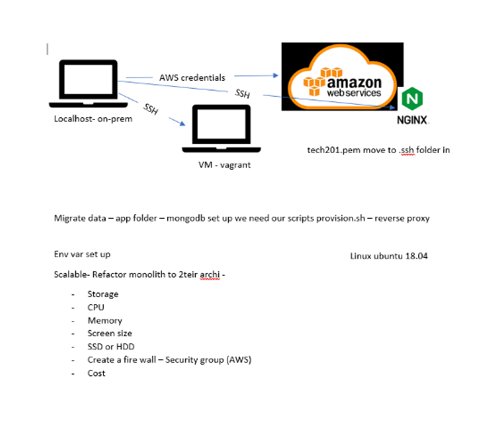

# Cloud computing with AWS

- When logging on to AWS make sure to never share your passwrod!! 
- Also make sure to always select Ireland as the location.  

### What is cloud computing??
- cloud computing is the delivery of computing services this inlcudes servers, storage, databases, networking, software, analytics, and intelligence over the cloud. This offers faster inovation and flexible resources.
### History of Cloud

### Different ypes of cloud 
- Public cloud, This ism offerd by third party providers, it is avalibale to anyone over the public internet also it scales quickly and is very convenient 
- private cloud, This is offerd to select users over the internet or private internal networks, it provides greater security control and requires traditional datacenter staffing and maintenance.
- Hybrid cloud, This is a combination of both the public and private cloud, shared security responsability and helps maintain tighter controls over sensative data processes. 

### what is AWS?
- Amazon Web Services (AWS) is a comprehensive cloud computing platform that includes infrastructure as a service (IaaS) and platform as a service (PaaS) offerings. AWS services offer scalable solutions for compute, storage, databases, analytics, and more.
- Infrastructure as a Service (IaaS): Provides virtualized computing resources, such as servers, storage, and networking, that can be rented and accessed over the internet. With IaaS, users are responsible for managing and securing their own applications and data.
- Platform as a Service (PaaS): Provides a platform for building and deploying software applications without the need to manage the underlying infrastructure. PaaS typically includes application development tools, databases, and middleware.
- Software as a Service (SaaS): Provides access to software applications over the internet, with the infrastructure and maintenance handled by the service provider. SaaS applications are typically accessed through a web browser.

### Histroy of AWS

- capital expenditure: you will need to buy servers,cables and networking equipment 
- Operational expenditure allows company to only pay for what they use, this provides companies with much higher levels of flexibility 

# launching an pp with aws steps

## step 1

- Make sure the name and tags is written as (your name- group name - app)

## Step 2

- make sure ubuntu 18.04 has been selected 

## Step 3

- Make sure instance type is t2.micro

## step 4

- make sure you select the correct key pair 

## step 5

- edit network settings
- make sure default vpc is selected 
- select subnet DevOpsStudent default 1a
- enable auto-assign public ip
- create security group 
- security group name same as the instance 
- add securtiy group make sure that ssh is with my ip, http is anywhere and add one more security group as anywhere and add port range 3000
- once all this is completed launch trhe machiine 

## step 6

- once you have launched connect to your instance and find ssh client 
- got to gitbash and follow the next steps
- run this command to get the correct permision `chmod 400 devops-tech201.pem` run `ls -ll` to see it has worked
- then run the ssh with this code `ec2-34-244-14-131.eu-west-1.computate.amazonaws.com`
- once inside the ssh then `sudo apt-get update -y`
- after this then `sudo apt-install nginx` to install nginx copy your ip adress and you should see nginx on your browser

