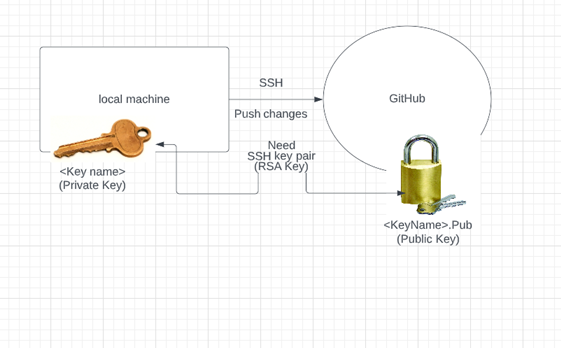
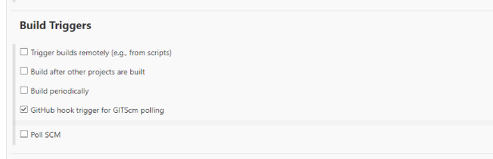
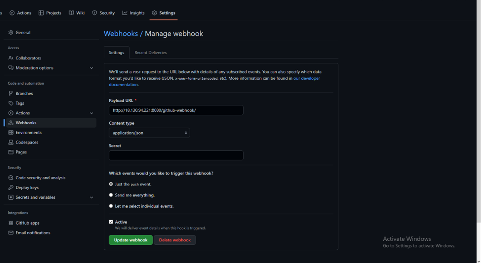

# SSH Key Pairs 

## How to creat SSH key pair and use it with github 

### Step 1
- open up a git bash terminal 
- CD into .ssh folder 
### Step 2
- generate a key 
- `ssh-keygen -t rsa -b 4096` -C "Email adress"
- call the file github-key

## step 4 
- go to github find your settings then go to ssh and gpg keys
- title it github-key 
- then is ssh key add your public key `cat github-key.pub`
- then you need to run the command `eval 'ssh=agent -s'` makie sure to use the command next to the number one on your keyboard not the single quotes 
- then just run `ssh-add github-key`

## step 5
- add private key to local host 
- run ` ssh -t git@github.com 
- you will see this come up if you have done it right 
- Hi AlexColmer! You've successfully authenticated, but GitHub does not provide shell access.
## step 6
- creating a new repo and using ssh to add content
- create a repo with test-ssh 
- create a new folder `mkdir test-ssh`
- create a new file in this folder `touch README.md`
- use this command to add content to the file `nano readme.md`
- save the change with `ctrl+x` `Y` then `enter 
- use `cat then the name of the file` to see if the change has been made 

## step 6nano
- `git init` 'creates the hidden folder `.git` and certain files that store the changes, commits, and changes in the staged area'
- `git add .` 'checking the status of all the changes made so far in the repo and making sure they are tracked by github'
- `git commit -m "notes on made changes"`, 'commits the changes made to the repo'
- `git branch -M main` 'switches the branch used to push the changes'
- `git remote add origin <the SSH path from your repo on github.com>` 'specifies the SSH version of the remote repo we want to use'
- `git push-u origin main` 'pushes the changes to the repo you picked and the branch through which you specify it'

## Creating CI/CD pipelines 
- When creating CI/CD piplines, start by aquring a new key view the steps you see above.
- Then you will need to create a new project on Jenkins and select discard old buils and do max 3 builds to keep.
- select git hub project and copy and past your HTTPS URL fro your GitHub repo with the app in it. 
- You will then need to restrict where the rpoject can be run from and type `sparta-ubuntu-node`
- Then in source code managment this is where you will add the private key that you made ealier. slelct git then add key and 
- then go down to build environemnt and select `provide node and npm bin/folder PATH
- Then build and select exicute sheel and type this code in there 
```
cd app
cd app
npm install
npm test
```
then build and you should pass the test. 

## Getting web-hook set up with you app 
-  To get the web-hook set up you will have to add this setting to your configuartion 
- then go to your git hub repo settign find web-hook and add this code into it
- now whenever you need to update you app push your changes to github and it will run the changes through jenkins aswell. 