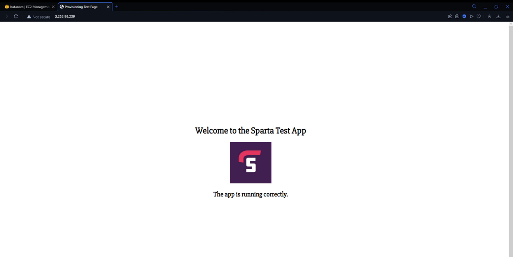

# VPC

### what is VPC
- Amazon Virtual Private Cloud (Amazon VPC) enables you to launch AWS resources into a virtual network that you've defined. This virtual network closely resembles a traditional network that you'd operate in your own data center, with the benefits of using the scalable infrastructure of AWS.

### What are the benefits ofa VPC 
- Greater control 
- enhanced security 
- cost saving 
- flexibility

### What are the benefitsd of a VPC for DevOps
- Security and compliance: private network environment for more secure and compliant deployments
- scalibility: easy to scale infatstructure based on demnd 
- collaboratio, provides a central and secure network for imporved colaboration and productivity. 

# Subnet/s
-A subnet, or subnetwork, is a network inside a network. Subnets make networks more efficient. Through subnetting, network traffic can travel a shorter distance without passing through unnecessary routers to reach its destination.

# Public and private subnets
- The instances in the public subnet can send outbound traffic directly to the internet, whereas the instances in the private subnet can't. Instead, the instances in the private subnet can access the internet by using a network address translation (NAT) gateway that resides in the public subnet.

# CIDR blocks
- CIDR (Classless Inter-Domain routing) block is a range of ip adresses that are used to define the network adress space for VPC or a subnet within the VPC
- an example of this is a CIDR block of 10.0.0.0/16 represents the IP address range from 10.0.0.0 to 10.0.255.255.

# Internet gateway
- A computer that sits between different networks or applications. The gateway converts information, data or other communications from one protocol or format to another. A router may perform some of the functions of a gateway. An Internet gateway can transfer communications between an enterprise network and the Internet.

# Route table/s
- A route table contains a set of rules, called routes, that determine where network traffic from your subnet or gateway is directed.

# How to set up vpc For app

## step 1
- go to VPC on aws 
- Create VPC
- when creating a VPC make it VPC only 
- name tag make it the usual nnaming conventio (name-tech201-VPC)
- ipv4 CIDR block 10.0.0.0/42
- now create the vpc
## Step 2
- Creatign an Internet gateway 
- just make a name with normal naming convention just add IG so that you know what you have done 
- Creat the IG
## step 3
- Creating a subnet 
- Select our vpc we have made and hit create subnet 
- once created go to associate subnet with VPC
## step 4
- Creating a route table (RT)
- find route tables on the left side and clikc create route table 
- name it normnally with RT 
- select our VPC again
- then select your rout table and sleect subnet associates and make sure it is associated with your subnet and also make sure that routes is local with destination 0.0.0.0 so everyone can use them. 
 - create a security gorup with the ports for out app so 22, 80, 3000. 
 - once all this is done go to ec2 and launch an instacne from ap ami and run it with your vpc your subnet and security grou pyou created 
 if it works you should be able to see your app running 
 
## Creating a private subnet for our DB
- like before we need to go to subnets and create a subnet 
- choose you VPC from the list 
- name the subnet according to the naming convention we always use
- In the IPV4 CIDR Block, pick a subnet available within the range. This might take a lot of trial and error as most of them might already be in use.
- then create the subnet 
### now creating a route table 
- select vpc from the list and create rout table 
- find subnet associations from the route table selection and edit the associating and associate it with the orivate subnet we created then save it
- this rout only needs to communicate with the local machine and not the internet so no need to add internet gateway for this. 
- when creating the security group for this you will need to only add one new group with the port of 27017 to allow the app to talk to our db 
## connecting the app with the db
- once the previous steps have been done launch the db with the private subnet and security goups we created. 
- once that is up and running all you should have to do is shh into the app and coneect it to the db by running the command `export DB_HOST=mongodb://ipv4-private-address-of-DB-EC2-instance:27017/posts` make sure to add the private ip adress of your db 
- then `printenv DB_HOST` to make sure it is working. 
- all you should have to do then is just cd into your app and `npm install`, `node seeds/seed.js` and then just `node app.js`
- finally run the app it with posts and you should get this 

There you go you have created a vpc, private and public subnet and then used that to run two tier architecture to get the app and db talking and working together. 
